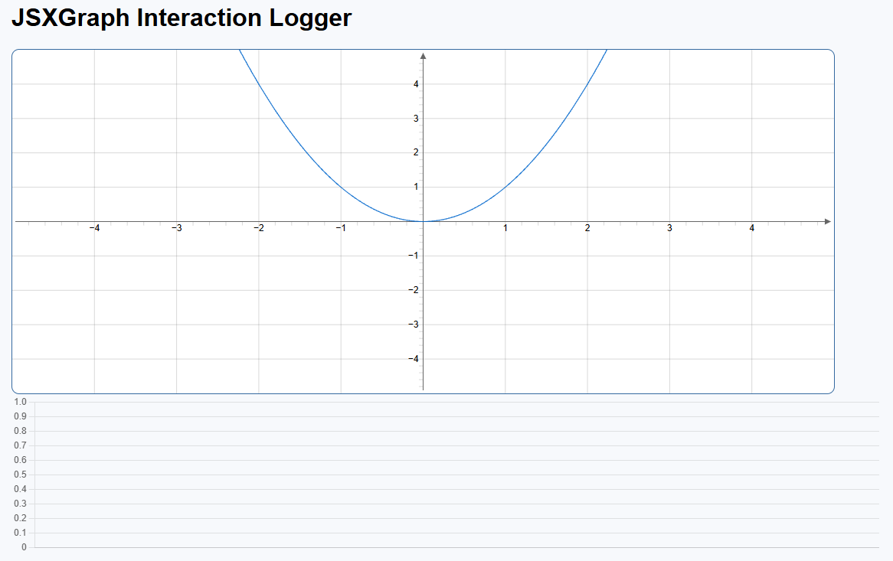

# JSXGraph User Interaction Patterns – Usability Study

A mobile-friendly web app to observe and log interaction patterns with JSXGraph.

## 💡 Features

- Interactive graph board
- Touch, zoom, pan, click logging
- Real-time chart updates
- Git versioning and screenshots

## 🧱 Stack

- HTML/CSS/JS
- JSXGraph
- Chart.js
- Optional: Firebase or backend

## 📸 Screenshots




## 🚀 Run

```bash
npx live-server
